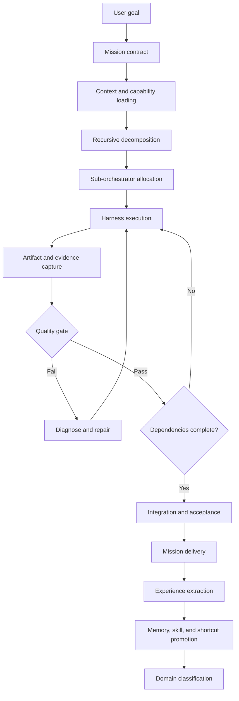

# Nexuss-Agent: Autonomous General-Intelligence Builder Workflow

## Executive Position

Nexuss-Agent should not become another research mode, WebDev mode, coding assistant, or prompt-driven AgentGPT clone. Those are **skills and operating policies** that run inside a more general system.

The product should become an **autonomous builder operating system**: a persistent, hierarchical society of specialized AI agents that can understand a difficult objective, recursively decompose it, select and operate tools, create and verify work, recover from failure, and convert validated practice into reusable experience, memory, skills, and real-world shortcuts.

> **Nexuss-Agent does not merely answer a request. It creates a mission, builds the result, proves the result, remembers what it learned, and becomes better prepared for the next mission.**

The difference between a theoretical AGI system and Nexuss-Agent is important. AGI would be one general intelligence. Nexuss-Agent is a **multi-agent cognitive and execution platform** designed to approximate generality through composition: one principal orchestrator, multiple sub-orchestrators, specialized harnesses, independent quality agents, persistent memory, and a promotion system that turns successful work into reusable capabilities.

## 1. Product Thesis: From Assistant to Autonomous Builder

An assistant primarily responds to a turn. An autonomous builder owns a mission across many turns, tools, files, processes, failures, and intermediate decisions.

| Assistant paradigm | Nexuss-Agent builder paradigm |
|---|---|
| Waits for the next prompt | Maintains an active mission until it is completed, blocked, or safely stopped |
| Treats the conversation as the main state | Treats the mission graph, artifacts, evidence, and checkpoints as the main state |
| Uses tools as isolated functions | Uses tools through specialized harnesses with contracts, budgets, and recovery policies |
| Asks the user whenever a detail is missing | Infers from context, inspects the environment, chooses reversible defaults, and asks only at true decision boundaries |
| Produces an answer or patch | Produces a verified result, evidence trail, reusable experience, and follow-up opportunities |
| Forgets most operational detail | Converts successful episodes into durable memory, skills, and shortcuts |
| Uses one agent persona | Uses a hierarchy of agents with distinct responsibilities and adversarial quality control |
| Measures completion by model confidence | Measures completion by observable acceptance criteria and independent verification |

The strategic advantage is not simply having more tools. It is creating a **closed learning-and-execution loop** in which every completed mission can improve future missions without turning unverified guesses into permanent knowledge.

## 2. What Makes Nexuss-Agent Different

Nexuss-Agent should compete on a different axis from products that primarily emphasize a polished autonomous coding session, a broad tool catalog, or a conversational workspace. The platform’s core distinction should be **recursive competence accumulation**.

### 2.1 The durable mission, not the chat turn

Every substantial request becomes a durable mission object. A mission contains its goal, interpretation, assumptions, plan, sub-missions, active agents, tool calls, artifacts, evidence, quality results, failures, checkpoints, and learned outcomes.

A page refresh must never erase the mission. A provider failure should pause or retry a step rather than destroy the work. A later project should be able to retrieve relevant experience from earlier missions without copying an entire transcript.

### 2.2 Hierarchical intelligence, not a flat swarm

Nexuss-Agent should not launch a random swarm of agents and hope that majority voting produces quality. It should use an explicit hierarchy.

The principal orchestrator owns the mission contract and final completion decision. Sub-orchestrators own bounded workstreams such as architecture, implementation, browser validation, security, documentation, or release. Harness agents operate tools and return structured evidence. Independent quality agents challenge results rather than merely agreeing with the executor.

The hierarchy gives every agent a scope, a parent, a budget, a definition of done, and an escalation policy.

### 2.3 Experience as a first-class product asset

The most valuable output of a mission is not always the final code. It is also the validated knowledge of what worked, what failed, what constraints mattered, which tools were reliable, how a system behaved, and how a future agent should approach a similar problem.

Nexuss-Agent should record experience as structured episodes, not as undifferentiated chat history. Experience becomes useful only after it passes validation and is classified by domain and subdomain.

### 2.4 Ask less, recover more

A general autonomous builder cannot ask the user to resolve every ambiguity. It needs an uncertainty policy that favors safe progress.

The default behavior should be:

1. Read the mission, project context, skills, memory, and available artifacts.
2. Inspect the real environment before guessing about it.
3. Infer the most likely intent from evidence and established project conventions.
4. Select a reversible implementation path when alternatives are equivalent.
5. Record assumptions and test them.
6. Branch internally when two interpretations are plausible.
7. Ask only when the next action is irreversible, unsafe, legally or financially consequential, impossible to infer, or blocked by a missing secret or permission.

This is not blind autonomy. It is **evidence-driven autonomy with controlled uncertainty**.

## 3. The Nexuss Cognitive Architecture

The platform should be divided into planes. Research, WebDev, coding, browser work, terminal work, and document generation belong in the capability plane. They should not become separate architectural products.

| Plane | Responsibility | Examples |
|---|---|---|
| Mission plane | Defines goals, constraints, success criteria, and completion | Mission contract, assumptions, acceptance criteria |
| Orchestration plane | Plans, delegates, schedules, retries, and merges work | Principal orchestrator, sub-orchestrators, dependency graph |
| Execution plane | Performs concrete work through tools and agent harnesses | Terminal, browser, search, parser, code editor, renderer |
| Verification plane | Independently checks correctness, safety, completeness, and quality | Tests, critics, reviewers, benchmark agents, policy gates |
| Knowledge plane | Stores and promotes experience, memory, skills, and shortcuts | Episode store, semantic memory, skill registry, workflow registry |
| Artifact plane | Stores outputs and their provenance | Source files, builds, reports, screenshots, datasets, releases |
| Control plane | Applies budgets, permissions, cancellation, recovery, and audit | Run state, leases, policies, event log, checkpoints |

The planes should be independently observable but connected by typed events. A model response should not directly mutate the knowledge plane. It should produce a candidate insight or artifact that enters a validation and promotion pipeline.

## 4. Agent Hierarchy

### 4.1 Level 0 — Principal Orchestrator

The principal orchestrator is responsible for the whole mission. It translates the user’s objective into a mission contract, decides whether the task is complete, allocates sub-orchestrators, manages global budgets, resolves conflicts, and delivers the final result.

It should not perform every tool call itself. Its job is to maintain the global model of the mission and keep the system moving toward the acceptance criteria.

### 4.2 Level 1 — Sub-Orchestrators

A sub-orchestrator owns one bounded objective and may recursively create lower-level work. Examples include:

| Sub-orchestrator | Responsibility |
|---|---|
| Systems architect | Converts goals into architecture, interfaces, constraints, and implementation order |
| Builder | Produces code, configuration, content, or other concrete artifacts |
| Environment operator | Manages terminal, browser, deployment, local services, and runtime inspection |
| Evidence analyst | Finds, extracts, normalizes, and links evidence to claims or acceptance criteria |
| Quality gate | Executes tests, checks invariants, compares outputs, and challenges assumptions |
| Security and policy agent | Reviews secrets, permissions, data flows, destructive actions, and compliance boundaries |
| Integrator and release agent | Merges verified work, updates documentation, prepares deployment, and records release evidence |
| Experience librarian | Extracts validated reusable knowledge and proposes memory, skill, or shortcut updates |

These are not fixed personas. They are role contracts that can be instantiated with different models, tools, and domain skills.

### 4.3 Level 2 — Specialist and Harness Agents

A harness agent is the controlled interface between reasoning and a tool domain. A browser harness understands navigation, page state, extraction, and interaction. A terminal harness understands command execution, process state, files, and test output. A WebDev harness understands application structure, routes, components, styling, and build verification.

The harness does not merely expose a raw tool. It translates agent intent into safe actions, captures evidence, handles retries, and returns normalized results.

### 4.4 Level 3 — Tools and External Systems

Tools are replaceable execution mechanisms. They include terminal sessions, browser engines, search, webpage extraction, file operations, renderers, model providers, deployment systems, and connector APIs.

A tool should declare its schema, side effects, timeout, retry policy, cancellation behavior, required permissions, evidence format, and whether it can be safely replayed.

### 4.5 The independent quality line

The agent that produces an artifact should not be the only agent that declares it correct. Quality agents must receive the mission contract and artifact evidence, but they should be able to challenge the builder’s assumptions.

For high-risk work, the quality line should be structurally independent from the execution line. The builder proposes. The verifier tests. The integrator accepts only evidence-backed work.

## 5. End-to-End Mission Workflow

The canonical workflow is a recursive loop rather than a linear chat pipeline.



### Phase 1 — Mission intake

The system receives a goal in natural language and builds a **mission contract**. The contract includes the objective, expected deliverables, constraints, project and domain, known context, success criteria, risk classification, available tools, and an initial autonomy budget.

The orchestrator should rewrite ambiguous natural language into an operational form while preserving the user’s intent. It should distinguish the desired outcome from the suggested method. For example, “build a website” is an outcome; “use a particular component” is a constraint only if the user explicitly makes it one.

### Phase 2 — Context loading

Before planning, the system loads relevant project instructions, domain knowledge, prior memories, available skills, proven shortcuts, repository state, open tasks, environment state, and provider capabilities.

When a new project is initialized, the orchestrator should read the project’s applicable knowledge pack before writing code. This pack should contain stable principles, domain memories, compatible skills, previous failure patterns, and trusted shortcuts—not every historical transcript.

### Phase 3 — Recursive decomposition

The principal orchestrator creates a dependency graph of outcomes, not merely a list of prompts. Each node has an owner, inputs, outputs, acceptance criteria, dependencies, estimated cost, risk, and retry policy.

A node may be simple enough for one harness agent, or it may become a child mission with its own planner, executor, verifier, and learning cycle. Recursion stops when a node is concrete, bounded, observable, and executable through an available harness.

### Phase 4 — Capability and agent allocation

The orchestrator chooses the smallest competent agent structure for each node. It should not create a hierarchy for a trivial task, and it should not give a single agent a mission that exceeds its context, tool, or verification capacity.

Model selection is a resource decision. A strong reasoning model may plan; a fast coding model may implement; a multimodal model may inspect a screenshot; a small model may classify logs. The system should route by capability and evidence needs rather than by brand identity.

### Phase 5 — Execution through harnesses

Agents execute through typed harness calls. Each call records intent, input summary, tool identity, start and end time, output, artifacts, errors, and cancellation state. Sensitive values are never placed into ordinary event logs.

Execution should be incremental. The agent makes a small change, runs an observable check, records the result, and advances. Large unverified batches make recovery and attribution difficult.

### Phase 6 — Verification and quality gates

Every meaningful workstream has a definition of done. The quality gate checks the artifact against that definition using independent evidence.

| Gate | Example question |
|---|---|
| Structural | Are the expected files, routes, interfaces, and artifacts present? |
| Behavioral | Does the feature perform the intended action in a real environment? |
| Regression | Did existing tests and workflows remain intact? |
| Visual | Does the rendered interface match the target hierarchy and state behavior? |
| Security | Are credentials protected and permissions bounded? |
| Operational | Can the work resume after refresh, failure, or cancellation? |
| Acceptance | Does the result satisfy the original mission contract? |

A failed gate creates a repair sub-mission. The orchestrator should preserve the failure evidence and avoid repeating the same failed strategy without new information.

### Phase 7 — Integration and completion

Once dependencies pass, the integrator assembles the result. It runs final checks, updates artifacts and documentation, summarizes assumptions, verifies that no unapproved side effects occurred, and marks the mission complete only when the acceptance criteria are satisfied.

Completion must be evidence-backed. “The code was written” is not completion. “The code was written, built, tested, visually checked, and deployed or packaged according to the mission contract” is completion.

### Phase 8 — Experience extraction

After delivery, the experience librarian analyzes the mission. It separates reusable knowledge from task-specific noise, identifies failures and their causes, extracts successful procedures, links evidence, and proposes updates to the knowledge plane.

This phase is essential. Without it, every mission starts from zero and the platform remains an expensive assistant rather than a compounding system.

## 6. The Learning and Promotion System

Nexuss-Agent should treat learning as a controlled promotion pipeline.

```text
Raw execution trace
        ↓
Mission episode
        ↓
Evidence-backed observation
        ↓
Validated experience
        ↓
Candidate memory / skill / shortcut
        ↓
Sandbox replay and quality review
        ↓
Versioned registry entry
        ↓
Future mission retrieval
```

### 6.1 Experience

Experience is a structured account of what happened during a mission. It includes the context, attempted strategy, tools used, constraints encountered, observations, failures, repairs, final outcome, and evidence references.

Experience is episodic and specific. It may say, “In this repository, the production build fails if the analytics placeholders are not defined, but the failure is a warning rather than a blocker.” It should not immediately become a universal rule.

### 6.2 Memory

Memory is a compressed, reusable fact or principle extracted from one or more experiences. Memory should have a scope, confidence, provenance, creation date, last validation date, domain, and invalidation conditions.

A memory can be project-local, organization-wide, domain-specific, or platform-wide. The narrower the scope, the easier it is to trust.

### 6.3 Skill

A skill is a repeatable capability contract. It describes when to use the capability, required inputs, available tools, procedure, expected outputs, failure modes, verification requirements, and security boundaries.

Research, WebDev, terminal work, browser automation, document creation, and model integration should be represented as skills or skill families. They should not hard-code the entire architecture of the platform.

A skill can be autonomously drafted or edited, but it must be versioned, tested, and promoted only after replay or independent review. The agent should never silently overwrite a trusted skill with an unverified draft.

### 6.4 Shortcut

A shortcut is a higher-level real-world workflow built from one or more validated skills. It automates a recurring outcome rather than a single tool action.

Examples include “initialize and ship a Vite application,” “audit a repository and produce a release patch,” “research a market and create a cited decision brief,” or “inspect a deployed web application, reproduce a bug, patch it, and verify the fix.”

Shortcuts should be executable, inspectable, parameterized, resumable, and reversible where possible.

### 6.5 Promotion rules

A candidate should be promoted only when it has evidence of success, a defined scope, a verification method, and a known failure boundary. Repeated successful use increases confidence, but repeated use without independent verification should not create false certainty.

| Knowledge object | Minimum promotion requirement |
|---|---|
| Experience | Mission trace plus outcome and evidence |
| Memory | Reusable observation with scope and provenance |
| Skill | Repeatable procedure with inputs, outputs, tools, and tests |
| Shortcut | End-to-end workflow replayed successfully with parameterized inputs |

## 7. Domain and Subdomain Classification

The knowledge plane should be organized as a graph, not a flat folder. A mission may belong to multiple domains and subdomains.

```text
Software Engineering
├── Frontend
│   ├── React
│   ├── Vite
│   ├── Accessibility
│   └── Visual QA
├── Backend
│   ├── APIs
   ├── Persistence
   ├── Authentication
   └── Streaming
├── Operations
│   ├── Containers
   ├── Deployment
   └── Observability
└── Security
    ├── Secrets
    ├── Permissions
    └── Data handling

Knowledge Work
├── Research
├── Evidence synthesis
├── Technical writing
└── Decision support

Real-World Operations
├── Browser workflows
├── Workspace automation
├── External systems
└── Approval-sensitive actions
```

Classification should be multi-label and evidence-backed. A skill generated from a React deployment mission might belong to Frontend, Vite, Deployment, Testing, and Visual QA simultaneously.

## 8. Autonomy Policy: When to Continue and When to Ask

Nexuss-Agent should default to autonomous continuation. However, autonomy needs a policy engine rather than a vague instruction to “be brave.”

### Continue autonomously when

The next action is reversible or testable, the environment provides enough evidence, the required tool is available, the action is within the mission budget, and a failure can be diagnosed without user input.

### Re-plan autonomously when

A tool fails, a test fails, an assumption is contradicted, a provider returns an unsupported format, an artifact is incomplete, or the current strategy is not producing evidence. The agent should create a repair branch, preserve the failure, and try a materially different approach.

### Escalate only when

The task is blocked by a missing credential or permission, the user’s intent has two materially different outcomes that cannot be inferred, the next step is irreversible or high-impact, the action creates legal/financial/safety exposure, or the system has exhausted bounded recovery strategies.

The user should be able to configure these boundaries. The platform should not confuse “no routine approval prompts” with “no policy controls.”

## 9. Platform Primitives to Build

The product roadmap should prioritize the primitives that make the workflow durable and compounding.

| Primitive | Purpose |
|---|---|
| Mission record | Durable top-level objective and contract |
| Work graph | Recursive tasks, dependencies, owners, and acceptance criteria |
| Agent lease | Prevents duplicate workers and defines ownership/timeouts |
| Event journal | Auditable normalized record of execution |
| Checkpoint | Resumable state after each meaningful step |
| Artifact registry | Files, outputs, evidence, provenance, and versions |
| Quality gate record | Independent pass/fail results with evidence |
| Policy registry | Tool permissions, data boundaries, budgets, and escalation rules |
| Experience store | Structured mission episodes and outcomes |
| Memory store | Scoped, versioned reusable observations |
| Skill registry | Versioned capabilities with tests and dependencies |
| Shortcut registry | Parameterized workflows built from trusted skills |
| Retrieval layer | Selects relevant context without loading the entire history |
| Replay harness | Re-executes skills and shortcuts in a controlled environment |
| Run control | Pause, resume, stop, retry, cancel, and recover |

## 10. How Research and WebDev Fit

Research should be a skill family for evidence gathering, source analysis, synthesis, and report production. It is not the identity of the platform.

WebDev should be a high-capability builder skill and harness family. It can include repository inspection, component design, implementation, testing, browser validation, deployment, and visual QA. It should not become a separate platform mode that owns the orchestration layer.

A single mission may combine both skills. For example, “build a production-grade dashboard from an ambiguous business requirement” may require research, architecture, WebDev, browser validation, security review, and deployment. The principal orchestrator should compose those capabilities automatically.

## 11. The Canonical Autonomous Builder Example

Consider the mission: “Create and ship a production-grade project workspace for a new domain.”

The principal orchestrator first reads the project initialization context and all applicable domain knowledge. It defines the mission contract and identifies uncertainty. A systems sub-orchestrator creates the architecture and acceptance criteria. A research sub-orchestrator gathers domain evidence only where it affects design decisions. A builder sub-orchestrator implements the application through terminal and WebDev harnesses. A browser harness validates real interaction states. A security agent audits secrets and permissions. A quality agent runs tests, checks the build, and compares the interface against the acceptance criteria. The integrator packages and ships the result.

After completion, the experience librarian records which planning pattern, tool sequence, model routing, debugging path, and verification steps succeeded. It proposes a reusable project-initialization skill and eventually a shortcut that can perform the workflow for future domains.

The user experiences one coherent mission, not a collection of disconnected agents. Internally, the platform has used a hierarchy and a quality line; externally, it delivers a result with evidence and a growing capability base.

## 12. Strategic Roadmap

### Stage 1 — Durable autonomous runtime

Build mission records, recursive work graphs, event journals, checkpoints, run controls, and streaming status. The system must survive refreshes, provider failures, cancellation, and partial completion.

### Stage 2 — Hierarchical builder loop

Implement the principal orchestrator, sub-orchestrators, harness contracts, dependency scheduling, budgets, and independent quality gates.

### Stage 3 — Knowledge compounding

Implement experience extraction, scoped memory, versioned skills, promotion rules, domain classification, retrieval, and replay.

### Stage 4 — General builder capability

Connect terminal, browser, search, parsers, renderers, model providers, deployment systems, and external connectors through standardized harness contracts.

### Stage 5 — Shortcut automation

Allow the system to generate reusable real-world workflows from repeatedly validated missions. Shortcuts should be parameterized and tested rather than recorded as opaque macros.

### Stage 6 — Self-improving orchestration

Use mission outcomes to improve decomposition, routing, recovery, verification, and skill selection. The system should learn which agent structures work for which classes of problems.

## 13. The Core System Prompt Principle

The system prompt should not attempt to encode every tool, domain, and workflow. It should define the agent’s **operating constitution**:

> Understand the mission. Inspect reality. Build a plan. Delegate recursively. Execute through controlled harnesses. Verify independently. Recover without unnecessary interruption. Preserve evidence. Deliver only when the acceptance criteria are satisfied. Extract validated experience and promote it carefully into reusable knowledge.

Skills, tools, memories, and shortcuts should be loaded dynamically according to the mission. The prompt defines the behavioral law; the knowledge plane supplies the learned capability; the orchestration runtime supplies persistence and control.

## Final Definition

Nexuss-Agent should become a **General Autonomous Builder Platform**: not a single agent pretending to know everything, but a persistent cognitive system that can assemble the right agents, tools, skills, memories, and verification loops for each difficult problem.

Its enduring advantage is the compounding loop:

```text
Mission → Decomposition → Execution → Verification → Delivery → Experience → Memory → Skill → Shortcut → Better Mission
```

That is the workflow that moves Nexuss-Agent beyond assistance. It turns every difficult task into both a completed result and an upgrade to the system that will solve the next difficult task.
