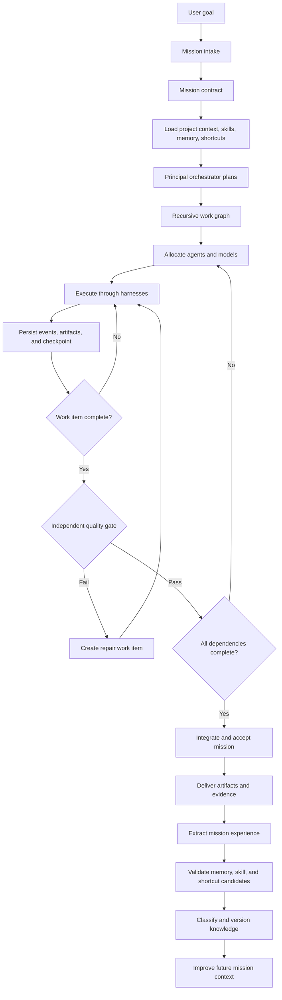
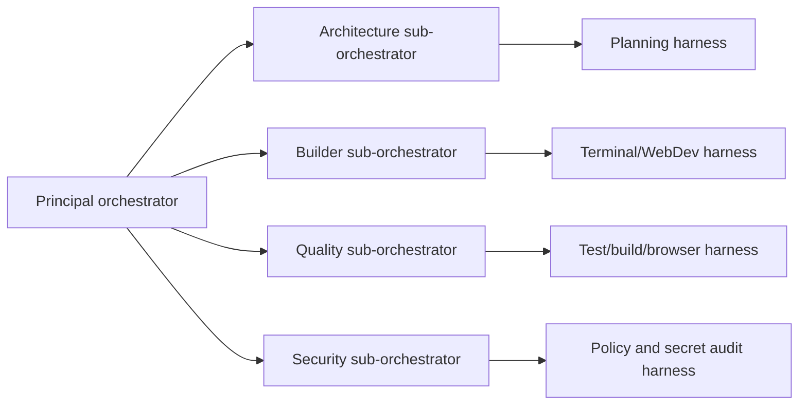
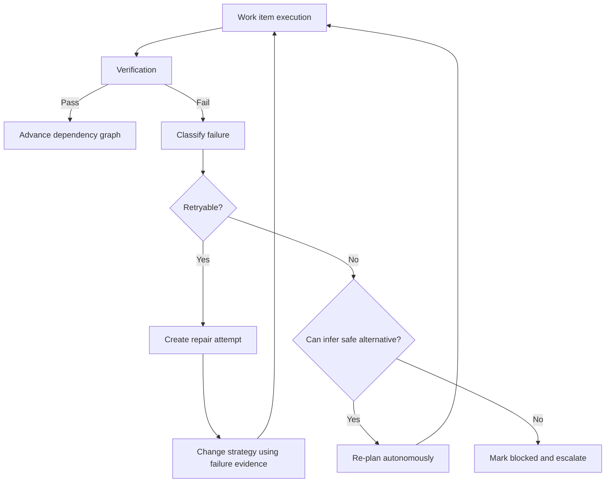
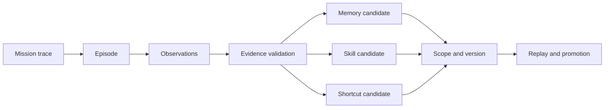

# Nexuss-Agent Full Autonomous Builder Workflow

## 1. Workflow Objective

Nexuss-Agent is a persistent autonomous builder system. It receives an objective, converts it into a durable mission, loads relevant knowledge, recursively delegates work to specialized agents, operates real tools through controlled harnesses, verifies the result independently, repairs failures, delivers artifacts, and extracts validated experience for future missions.

The user should experience one coherent mission. Internally, the platform may use many agents, models, tools, work items, checkpoints, and quality gates.

> **The chat is the entry point and communication surface. The mission runtime is the actual system of intelligence and execution.**

## 2. Complete Workflow at a Glance



## 3. The Two Sides of the Workflow

Every mission has a **user-visible surface** and an **internal execution surface**. These must remain separate so that the user gets clarity without losing access to audit detail.

| User-visible surface | Internal execution surface |
|---|---|
| Goal entry in chat or mission composer | Mission contract and normalized intent |
| Current mission status | State machine and lease ownership |
| High-level progress | Work graph, child missions, and dependencies |
| Active task summary | Agent prompts, model routing, and tool calls |
| Relevant activity trace | Structured event journal and tool evidence |
| Test and quality summary | Independent verifier outputs and policy results |
| Repair status | Failure classification, retry strategy, and repair branch |
| Final artifacts | Artifact registry, provenance, checksums, and versions |
| Reusable result summary | Experience, memory, skill, and shortcut promotion |

The internal surface should never be hidden from auditors or advanced users, but it should not pollute the normal conversation with raw control messages, token traces, credentials, or private orchestration details.

## 4. Stage One — User Goal and Mission Intake

The workflow starts when a user gives an objective. The goal can be simple or difficult, but the platform should not assume that every request requires the same level of autonomy.

Example:

```text
Build a production-ready workspace for managing deployment incidents.
```

The intake layer identifies the project, user, domain, desired artifact, constraints, urgency, risk, and likely capability families. It does not decide the implementation yet.

The platform should also identify whether this is a continuation of an existing mission, a new mission derived from a previous result, or a request to execute a stored shortcut.

### Intake output

```text
missionId
ownerId
projectId
rawGoal
normalizedGoal
initialRisk
requestedDeliverables
candidateDomains
candidateSkills
availableTools
```

## 5. Stage Two — Mission Contract

The normalized goal becomes a durable mission contract. This is the first major difference from ordinary chat. The mission contract defines what the system is trying to achieve and how it will know that it has achieved it.

```ts
type MissionContract = {
  goal: string;
  deliverables: Deliverable[];
  acceptanceCriteria: AcceptanceCriterion[];
  constraints: Constraint[];
  assumptions: Assumption[];
  projectScope: ProjectScope;
  riskLevel: "low" | "medium" | "high" | "critical";
  autonomyPolicy: AutonomyPolicy;
  executionBudget: ExecutionBudget;
  completionPolicy: CompletionPolicy;
};
```

The contract is editable by the orchestrator while planning, but changes must be versioned. A silent change to the goal would make the audit trail unreliable.

### Mission status

```text
created → queued → planning
```

## 6. Stage Three — Context and Knowledge Loading

Before planning, the orchestrator loads context from the project and knowledge planes. The system should not load every historical conversation. It should retrieve the smallest relevant set of project rules, memories, skills, shortcuts, previous failures, artifacts, and environment facts.

The context loader should inspect:

| Context category | Examples |
|---|---|
| Project context | Repository, package scripts, architecture, current branch, open work |
| User context | Preferences, workspace permissions, selected provider and model policy |
| Domain context | Frontend, backend, deployment, research, finance, documentation |
| Skill context | React implementation, browser validation, terminal debugging |
| Memory context | Previously validated facts and constraints |
| Shortcut context | Trusted parameterized workflows |
| Environment context | Running services, installed tools, authenticated connectors |
| Failure context | Known errors, rejected approaches, and recovery instructions |

The output becomes a **mission context pack** attached to the mission version. This makes the planning decision reproducible.

## 7. Stage Four — Principal Orchestrator Planning

The principal orchestrator is responsible for turning the mission contract into an executable plan. It does not need to perform every action. It decides the shape of the work.

The orchestrator creates:

1. A dependency graph of work items.
2. A definition of done for each work item.
3. A proposed agent role for each work item.
4. A required skill and harness set.
5. A budget and timeout.
6. A verification method.
7. A recovery strategy.
8. A list of assumptions that must be tested.

Example work graph:

```text
Root mission: Build deployment-incident workspace
├── W1: Inspect product requirements and repository
├── W2: Define data and interaction architecture
├── W3: Implement frontend workspace
├── W4: Implement backend persistence and API
├── W5: Add authentication and security checks
├── W6: Run unit, type, build, and browser verification
├── W7: Repair any failed checks
└── W8: Package artifacts and release evidence
```

### Recursive planning rule

A work item becomes a child mission when it has its own meaningful objective, multiple dependencies, independent verification, or a need for a specialized orchestrator. It remains a simple work item when it is concrete, bounded, and directly executable through one harness.

```text
Principal orchestrator
  → child mission: frontend implementation
      → work item: create route
      → work item: build components
      → work item: verify responsive state
```

Recursion stops when the task has clear inputs, a bounded action, an observable output, and a verification method.

### Mission status

```text
planning → planned → executing
```

## 8. Stage Five — Agent and Model Allocation

The orchestrator assigns roles rather than randomly spawning agents. Every agent receives a bounded scope and an explicit contract.



Model routing is a resource decision, not an architectural identity. A planning model may create the work graph, a coding model may modify a repository, a vision model may inspect a screenshot, and a smaller model may classify logs. All of them operate under the same mission contracts and quality rules.

### Agent assignment contract

```text
agentId
role
parentWorkItemId
allowedSkills
allowedHarnesses
inputArtifacts
acceptanceCriteria
budget
timeout
retryPolicy
escalationPolicy
```

## 9. Stage Six — Harness-Based Tool Execution

Agents do not receive unlimited direct access to tools. They operate through harnesses that validate intent, enforce permissions, execute actions, collect evidence, and normalize results.

### Harness flow

```text
Agent decision
  → harness validates schema and permission
  → harness checks workspace and budget
  → tool executes
  → harness captures output and side effects
  → result is normalized
  → event and checkpoint are persisted
```

A terminal harness may permit repository-local file inspection, editing, testing, and building. A browser harness may permit navigation and verification. A deployment harness may require a stronger policy boundary than a read-only inspection harness.

### Harness contract

```ts
type HarnessResult = {
  success: boolean;
  summary: string;
  artifacts: ArtifactRef[];
  evidence: EvidenceRef[];
  sideEffects: SideEffect[];
  retryable: boolean;
  cancelled: boolean;
  error?: HarnessError;
};
```

The harness must never place API keys, cookies, raw secrets, or unbounded sensitive output into ordinary mission events.

## 10. Stage Seven — Events, Checkpoints, and Mission Durability

Every meaningful action creates a normalized event. Every safe continuation point creates a checkpoint.

### Event categories

| Event | Meaning |
|---|---|
| `mission.created` | Mission contract was created |
| `mission.planned` | Work graph was accepted |
| `agent.assigned` | An agent received a bounded work item |
| `harness.started` | A tool-domain operation began |
| `harness.completed` | A tool-domain operation returned |
| `artifact.created` | A file or output artifact was registered |
| `quality.started` | Verification began |
| `quality.failed` | Verification rejected the work |
| `repair.created` | A repair branch was created |
| `checkpoint.saved` | Resumable state was persisted |
| `mission.paused` | Execution was intentionally paused |
| `mission.stopped` | Execution was cancelled |
| `mission.completed` | Acceptance criteria passed |
| `experience.extracted` | Post-mission learning was recorded |

### Checkpoint contents

```text
mission version
current work item
completed work items
pending dependencies
active agent lease
latest artifact references
quality results
next action
retry counts
policy state
```

A refresh or server restart should reload the latest checkpoint and continue from it. A retry must use idempotency keys so the same external side effect is not performed twice.

## 11. Stage Eight — Verification and Quality Gates

The builder’s result is only a proposal until it passes independent verification. Verification is a separate execution line with its own agent, tools, and evidence.

```text
Builder output
  → structural checks
  → behavior checks
  → regression checks
  → visual checks
  → security checks
  → operational checks
  → acceptance decision
```

### Quality result

```ts
type QualityResult = {
  gateId: string;
  workItemId: string;
  status: "passed" | "failed" | "inconclusive";
  checks: QualityCheck[];
  evidence: EvidenceRef[];
  failureClass?: string;
  recommendedRepair?: string;
};
```

The quality agent must be able to reject the builder’s work. It should not inherit an unverified completion claim from the builder.

## 12. Stage Nine — Repair and Recovery Loop

Failure is a normal part of autonomous work. The platform’s responsibility is to make failure useful rather than destructive.



The repair loop must preserve the failed attempt, the diagnosis, the changed strategy, and the result. The system should not hide failures by overwriting the event history.

### Recovery categories

| Failure | Default behavior |
|---|---|
| Provider timeout | Retry with bounded backoff or route to a compatible model |
| Malformed provider stream | Record parser evidence, repair adapter, retry if safe |
| Type/test failure | Create a repair work item with exact failure output |
| Browser mismatch | Capture screenshot/state, adjust implementation, re-verify |
| Missing permission | Re-plan with available capability or escalate |
| Missing secret | Pause without logging the secret and request secure configuration |
| Irreversible action | Require policy decision before execution |
| Ambiguous requirement | Branch internally or escalate only when outcomes differ materially |

## 13. Stage Ten — Integration and Mission Completion

When all dependencies and quality gates pass, the integrator assembles the result. It checks that artifacts are complete, verifies no unapproved side effects occurred, and compares the final state against the original mission contract.

A mission is complete only when:

```text
acceptance criteria pass
required artifacts exist
quality evidence is present
security checks pass
pending repairs are resolved
no required dependency is incomplete
final state is persisted
```

The completion event should reference the exact artifact versions, quality results, and checkpoint from which completion was reached.

## 14. Stage Eleven — User Delivery

The user receives a concise outcome rather than an internal transcript. The delivery should include what was completed, important artifacts, verification results, known limitations, and the mission trace link.

```text
Mission completed

Result: Deployment-incident workspace implemented
Artifacts: repository patch, build output, screenshots, release notes
Verification: type check, tests, build, browser flow, security review
Known limitation: deployment credentials were not available for live publish
Reusable learning: 3 validated memories, 1 skill candidate
```

The user can inspect deeper details through the run trace, but normal chat remains focused on the result.

## 15. Stage Twelve — Experience Extraction

After delivery, the experience librarian analyzes the mission. It does not blindly summarize the transcript. It extracts what was learned from actual practice.



### Extraction layers

| Layer | Content |
|---|---|
| Episode | Full structured account of the mission |
| Observation | A specific fact learned during execution |
| Experience | A validated strategy, failure pattern, or constraint |
| Memory | A reusable scoped fact or principle |
| Skill | A repeatable procedure with contracts and tests |
| Shortcut | A parameterized end-to-end workflow |

## 16. Stage Thirteen — Knowledge Promotion

Knowledge promotion is a controlled compiler, not an automatic transcript dump.

### Promotion requirements

```text
provenance
scope
confidence
verification evidence
known failure boundary
version
invalidation condition
replay result where applicable
```

A skill may be drafted by the agent, but it should remain a candidate until it passes replay or independent review. A shortcut should not be generated from one lucky run unless its procedure is clearly bounded and reproducible.

### Example promotion

```text
Mission:
  Repair OpenAI-compatible SSE parser

Experience:
  Provider closed without a trailing newline; final buffer was not consumed.

Memory candidate:
  Flush the final SSE buffer before classifying a stream as empty.

Skill candidate:
  Validate provider stream framing, payload variants, finish signals, and final-buffer handling.

Shortcut candidate:
  Diagnose provider stream → patch adapter → run parser tests → build → publish.
```

## 17. Stage Fourteen — Future Mission Preparation

When a new mission begins, the system retrieves relevant promoted knowledge and adds it to the context pack. It does not load every skill or memory globally.

```text
new mission
  → domain classification
  → retrieve relevant memories
  → retrieve compatible skills
  → retrieve trusted shortcuts
  → check versions and dependencies
  → create context pack
  → plan with accumulated experience
```

The result is compounding capability. A future mission can begin with proven strategies and known failure boundaries while still verifying whether they apply to the current environment.

## 18. Full Example: Autonomous Coding Mission

The user says:

```text
Add a real-time collaborative deployment dashboard to this project and ship it.
```

The complete internal flow is:

1. The intake layer creates a mission and identifies the repository, project, deliverables, and risk.
2. The mission contract defines acceptance criteria: working dashboard, persistent data, authenticated access, responsive UI, tests, build, and deployment evidence.
3. The context loader reads project conventions, existing architecture, relevant frontend/backend skills, deployment memories, and trusted shortcuts.
4. The principal orchestrator creates architecture, implementation, security, verification, and release workstreams.
5. The architecture sub-orchestrator inspects the codebase and produces interfaces and dependency order.
6. The builder sub-orchestrator assigns frontend and backend work to specialized agents.
7. Terminal and WebDev harnesses inspect files, edit code, run tests, and capture artifacts.
8. Every action creates events and checkpoints.
9. The quality sub-orchestrator runs type checking, unit tests, production build, and browser verification.
10. If the dashboard fails a responsive interaction test, the orchestrator creates a repair work item with the exact evidence.
11. The builder changes the implementation and the quality agent reruns the failed gate.
12. The security agent checks authentication, authorization, secret handling, and data boundaries.
13. The integrator confirms that all acceptance criteria and dependencies pass.
14. The user receives the verified dashboard, artifacts, evidence, and known limitations.
15. The experience librarian extracts reusable frontend, deployment, and debugging knowledge.
16. The promotion system validates a new skill or shortcut through replay before adding it to future project context.

The user sees one mission progressing from planning to delivery. The platform performs a hierarchy of coordinated work internally.

## 19. What the User Sees During the Run

The Run view should show high-value state rather than raw internal reasoning:

```text
Mission: Add collaborative deployment dashboard
Status: Verifying
Progress: 8 of 11 work items complete
Active owner: Quality sub-orchestrator
Current check: Browser interaction and responsive layout
Latest artifact: dashboard-preview.png
Repair attempts: 1
Checkpoint: 14:32:08 UTC
```

The user can expand the activity trace to see agent roles, tool summaries, test results, artifacts, and failures. Internal hidden instructions, credentials, and private chain-of-thought must not be shown.

## 20. The System Prompt’s Place in the Workflow

The system prompt belongs at the top of the stack as the behavioral constitution. It should define the agent’s principles, not contain every domain procedure.

```text
Constitution:
  act toward mission completion
  inspect reality before assuming
  decompose recursively
  use controlled harnesses
  preserve evidence
  verify independently
  recover from failure
  minimize unnecessary interruption
  protect secrets and permissions
  promote only validated learning
```

The mission contract supplies the current objective. The orchestrator supplies the plan. Skills supply reusable procedures. Tools supply real-world action. Memory supplies relevant experience. Quality gates supply proof.

## 21. Final Runtime Formula

```text
System Constitution
+ Mission Contract
+ Context and Knowledge Pack
+ Hierarchical Orchestrator
+ Specialized Agents
+ Skill Registry
+ Harness and Tool Layer
+ Event Journal
+ Checkpoints
+ Independent Quality Gates
+ Repair Loop
+ Artifact Registry
+ Experience Compiler
+ Memory / Skill / Shortcut Promotion
= Nexuss-Agent Autonomous Builder Runtime
```

The platform becomes different when it can do more than produce a good answer. It must be able to own a difficult objective, continue across time, coordinate multiple agents, operate real systems, prove the result, recover from failure, and improve its future behavior from validated practice.
